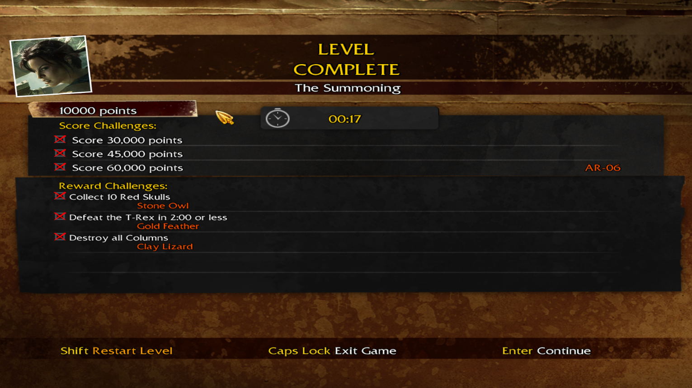
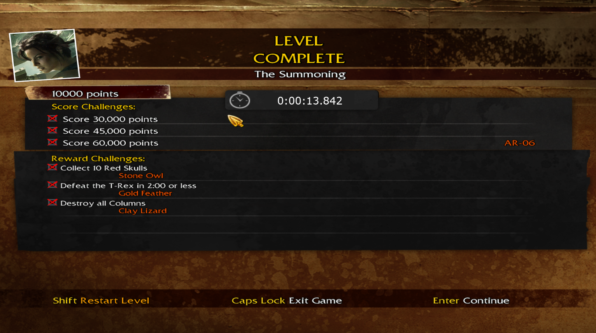

# LCGoL D3D9 Wrapper
## Current Features:
- Reads LCGoL Memory
- Displays In-Game Time to the nearest millisecond
#### Before:

#### After:

## How to install:
Copy the d3d9.dll from the Releases folder into your game's directory.
